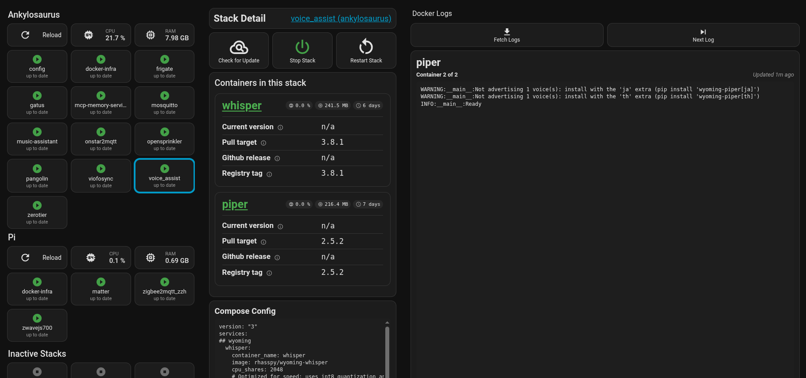

# Dashboard examples

[`docker_stacks_v4.yaml`](docker_stacks_v4.yaml) — an example Lovelace
dashboard for this integration: a stack overview grid grouped by site,
plus a detail panel for whichever stack is selected, showing its
containers, current/pull target/registry/GitHub-release versions, and
compose config.



(This screenshot is from the previous version of the dashboard —
it'll be replaced.)

It depends on:

- `custom:button-card` — the only HACS frontend card it needs (install
  from HACS).
- Two helper entities. Create them under **Settings → Devices & services
  → Helpers**, or add this to `configuration.yaml` and restart:

  ```yaml
  input_text:
    selected_stack:
      name: Selected stack
      max: 255
  input_number:
    container_log_index:
      name: Container log index
      min: 0
      max: 99
      step: 1
      mode: box
  ```

Nothing in the dashboard file needs editing. It discovers sites, stacks
and containers from the integration's own entities — their `site`,
`stack` and `kind` attributes — rather than from any hardcoded name, so
it works whatever you've named your sites.

## Using it

- Tap a stack tile to select it.
- Right-click (or Ctrl-click, or long-press on touch) a stack tile for
  its more-info dialog.
- The **Reload** button re-scans the compose files of that site only.

## Disabled-by-default entities

This integration currently ships one sensor disabled by default,
`{service} log command` (a copy-pasteable `docker logs -f` command) — the
dashboard doesn't read it, so it has no effect here. Every entity this
dashboard does read is enabled by default; nothing needs enabling under
**Settings → Devices & services → Entities** for it to show fully
populated.
